# Current Architecture Flow: AI Agent Service + Skills + Harness

這份文件用流程圖整理目前 AI Agent Service 的實際架構，包含：

- `/agent` 對話 API 如何運作
- `/tools` 與 Tool Registry 如何運作
- LangGraph + Harness 如何呼叫 `SKILL.md`
- 任務 / run / tool / skill 的狀態目前如何管理
- 漸進式 skills / prompts 分層架構如何劃分
- 目前已完成與下一階段尚未完成的邊界

> 注意：這份文件描述的是 **目前 repo 裡已實作的架構**，並標出下一階段建議，不會把尚未完成的功能說成已完成。

---

## 1. 一張總覽圖

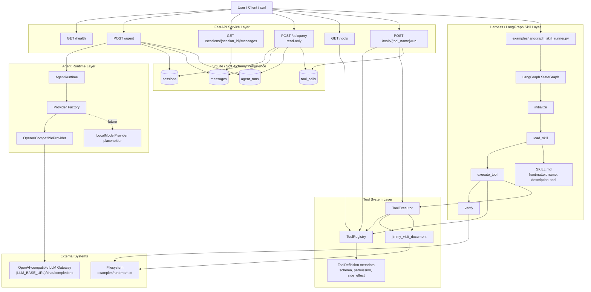

### 這張圖的重點

目前系統已經有三條可用路徑：

1. **對話路徑**：`/agent` → `AgentRuntime` → LLM gateway → 存入 `sessions/messages/agent_runs`
2. **工具路徑**：`/tools/{tool_name}/run` → `ToolRegistry` → `ToolExecutor` → tool handler → 存入 `tool_calls`
3. **Skill Harness 路徑**：CLI runner → LangGraph workflow → 讀 `SKILL.md` → 呼叫 Tool Registry / Executor → verification

目前 **Skill Harness 路徑還沒有接成 API**，現在是透過：

```bash
PYTHONPATH=src python3 examples/langgraph_skill_runner.py ...
```

---

## 2. `/agent` 對話 API 流程

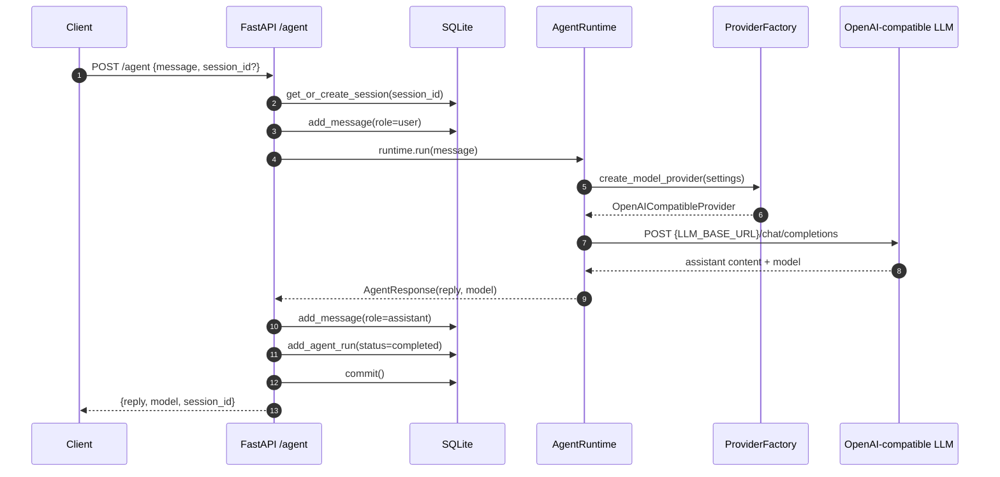

### 目前狀態管理

| 資料 | 存在哪裡 | 目前狀態欄位 | 說明 |
|---|---|---|---|
| Session | `sessions` | 無明確 status | 目前只管理 session id / title / timestamps |
| Message | `messages` | `role` | `user` / `assistant` |
| Agent run | `agent_runs` | `status` | 目前預設 `completed`，有 `error` 欄位但 `/agent` 尚未完整做失敗 run 記錄 |

目前 `/agent` 還沒有完整 task lifecycle，例如 `pending → running → verified → needs_review`。這是下一階段可補的部分。

---

## 3. `/tools` 與 Tool Registry 流程

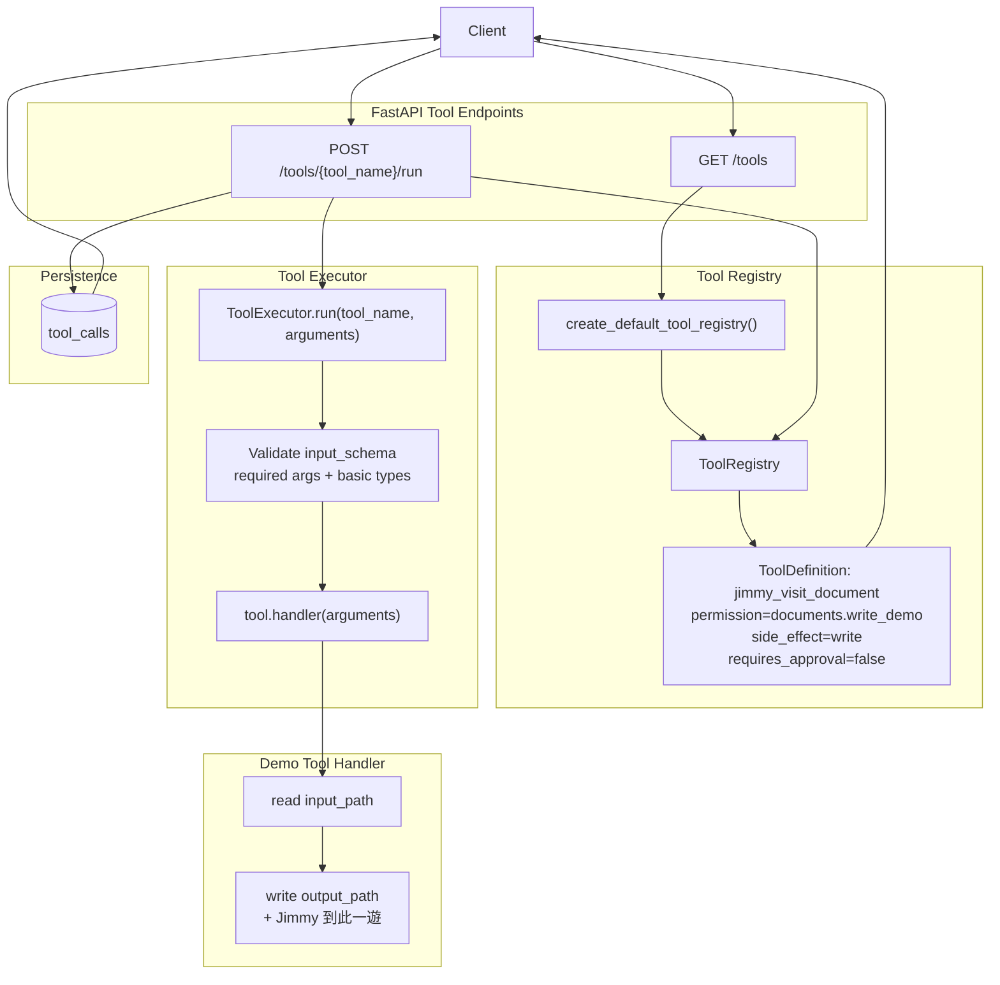

### Tool metadata 是 executable source of truth

目前 `ToolRegistry` 裡的 `ToolDefinition` 才是可執行工具的真實來源，不是 `SKILL.md`。

`ToolDefinition` 包含：

```text
name
description
input_schema
output_schema
permission
side_effect
timeout_seconds
retry
requires_approval
owner
audit_level
handler
```

### Tool call 狀態

| 狀態 | 來源 | 說明 |
|---|---|---|
| `success` | `/tools/{tool_name}/run` 成功執行 | 寫入 `tool_calls.status` |
| `error` | `ToolExecutionError` 或 handler 失敗 | 寫入 `tool_calls.status` 與 `error_message` |

目前 Tool Executor 支援 schema 驗證與錯誤回傳，但還沒有：

- timeout enforcement
- retry execution
- approval gate
- per-user permission check

這些 metadata 已先放在 `ToolDefinition`，方便後續補上。

---

## 4. `SKILL.md` 如何呼叫 tool

目前已實作一條 CLI 測試路徑：

```text
examples/langgraph_skill_runner.py
```

它會讀取：

```text
examples/skills/jimmy-visit-skill/SKILL.md
```

skill 的 frontmatter：

```yaml
---
name: jimmy-visit-skill
description: Read a text file and write a new file with the Jimmy visit marker.
tool: jimmy_visit_document
---
```

### Skill 呼叫 tool 的 LangGraph 流程

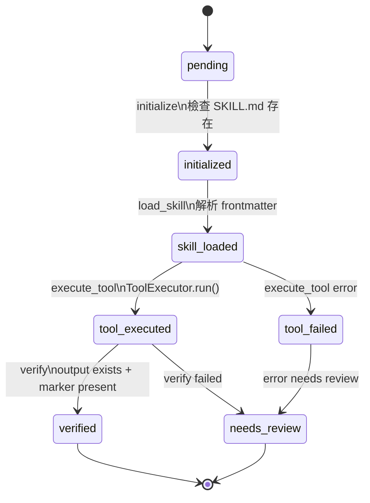

### LangGraph state 內容

目前 `HarnessSkillState` 是一個 in-memory state，不會自動寫入 DB：

```text
skill_path
arguments
skill
selected_tool
tool_result
verification
status
steps
errors
```

範例執行後的狀態：

```json
{
  "status": "verified",
  "steps": ["initialize", "load_skill", "execute_tool", "verify"],
  "selected_tool": "jimmy_visit_document",
  "verification": {
    "output_path_exists": true,
    "marker_present": true
  }
}
```

### 目前 Skill Harness 尚未做的事

目前已做：

```text
SKILL.md → LangGraph → ToolRegistry → ToolExecutor → verification
```

尚未做：

```text
POST /skills/run
agent_steps / run_steps DB persistence
LLM planner 自動選 skill / tool
tool_calls 與 LangGraph CLI runner 整合寫 DB
permission / approval gate
```

---

## 5. 任務狀態如何管理：目前 vs 建議下一階段

### 目前已存在的狀態來源

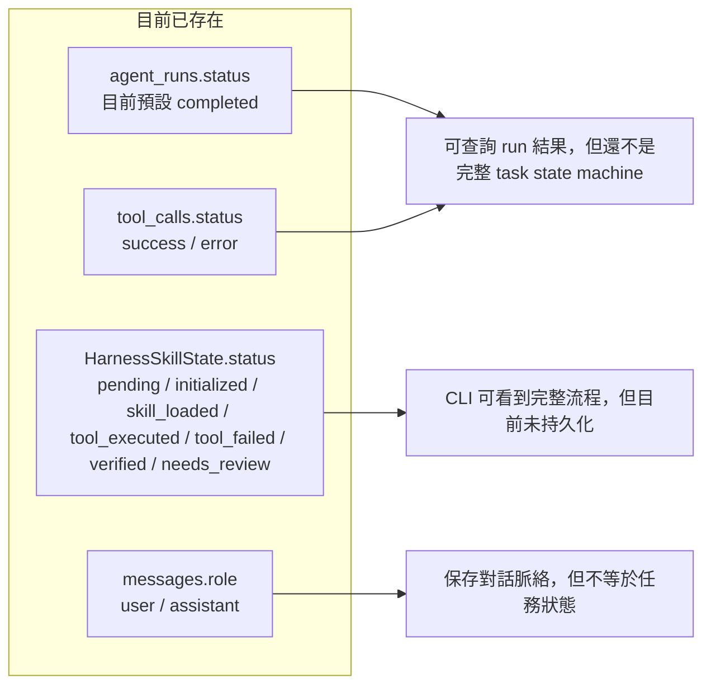

### 建議下一階段 task/run 狀態機

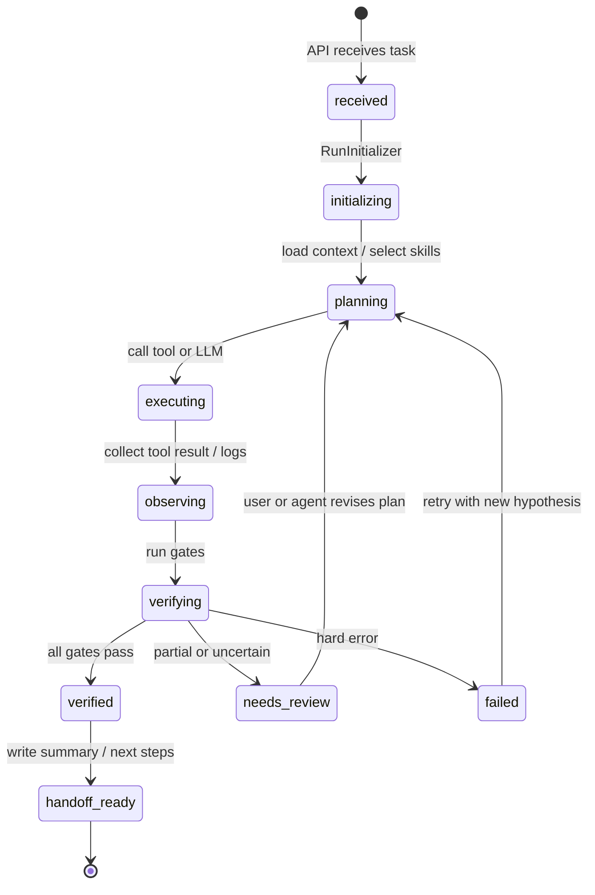

### 建議新增資料表

| 表 | 用途 |
|---|---|
| `tasks` | 管理使用者任務，包含 goal、constraints、done_criteria、status |
| `agent_steps` 或 `run_steps` | 保存 LangGraph 每個 node 的輸入、輸出、狀態、錯誤 |
| `verification_results` | 保存 pytest / ruff / smoke test / file check 結果 |
| `run_handoffs` | 保存本次 run 做了什麼、如何驗證、下一步是什麼 |

---

## 6. 漸進式分層架構

這裡把目前專案切成「由下而上」的 progressive layers。越下面越穩定、越 deterministic；越上面越接近 LLM-driven agent 行為。

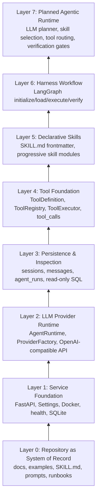

### 各層目前狀態

| Layer | 名稱 | 目前狀態 | 說明 |
|---|---|---|---|
| 0 | Repository as System of Record | 已開始 | docs/runbooks/examples 已逐步建立 |
| 1 | Service Foundation | 已完成 MVP | FastAPI、Docker、health、settings |
| 2 | LLM Provider Runtime | 已完成 MVP | OpenAI-compatible provider 可用 |
| 3 | Persistence & Inspection | 已完成 MVP | SQLite + read-only SQL |
| 4 | Tool Foundation | 已完成 Phase 2 | Tool Registry / Executor / tool_calls |
| 5 | Declarative Skills | 部分完成 | `SKILL.md` 可由 CLI runner 讀取，progressive docs 已定義方向 |
| 6 | Harness Workflow | 最小可測試版本 | LangGraph CLI runner 可 initialize/load/execute/verify |
| 7 | Agentic Runtime | 尚未完成 | 尚未有 LLM planner、自動選 skill/tool、verification gates |

---

## 7. 漸進式 Skill / Prompt 載入流程

目前 canonical 教學集中在 `docs/skills-and-tools.md`；舊版 progressive loading 筆記已移到 `docs/archive/progressive-skills-and-prompts.md`。下面是建議未來 `SkillLoader` / `PromptBuilder` 的流程。

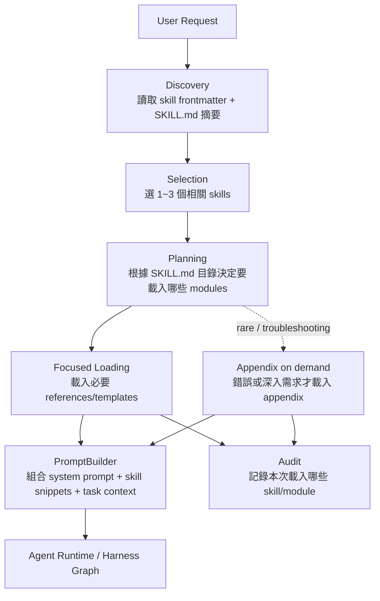

### 建議資料夾結構

```text
examples/skills/<skill-name>/
├── SKILL.md                       # 短，像目錄與入口規則
├── references/                    # 任務需要時才載入
│   ├── 01-*.md
│   └── 02-*.md
├── templates/                     # 要輸出特定格式時才載入
│   └── *.md / *.json
├── scripts/                       # 真正需要執行才使用
│   └── *.py / *.sh
└── appendix/                      # 低頻、長篇、疑難排解
    └── *.md
```

### Skill 與 Tool 的分工

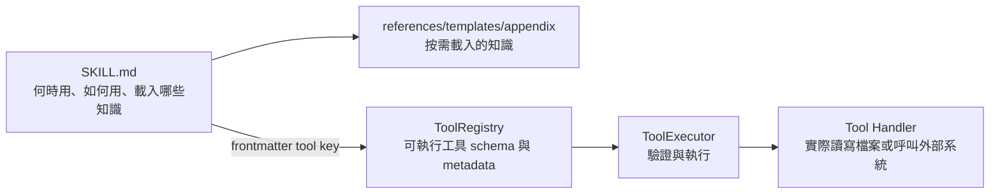

重要原則：

- `SKILL.md` 是知識與操作規則，不是直接執行程式。
- `ToolRegistry` 是 executable source of truth，保存真正可執行工具的 schema / permission / side_effect。
- `ToolExecutor` 負責在執行前驗證參數，之後才呼叫 handler。

---

## 8. 目前資料模型關係

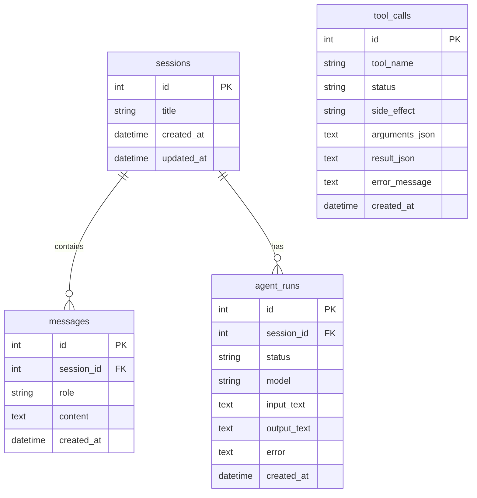

目前 `tool_calls` 尚未關聯到 `agent_runs`，因為 `/tools/{tool_name}/run` 可以獨立執行。後續如果要整合完整 agent loop，建議新增：

```text
tool_calls.run_id -> agent_runs.id
agent_steps.run_id -> agent_runs.id
verification_results.run_id -> agent_runs.id
```

---

## 9. 未來完整 Agent Harness 目標圖

下面是建議下一階段演進圖，不是目前已完成狀態。

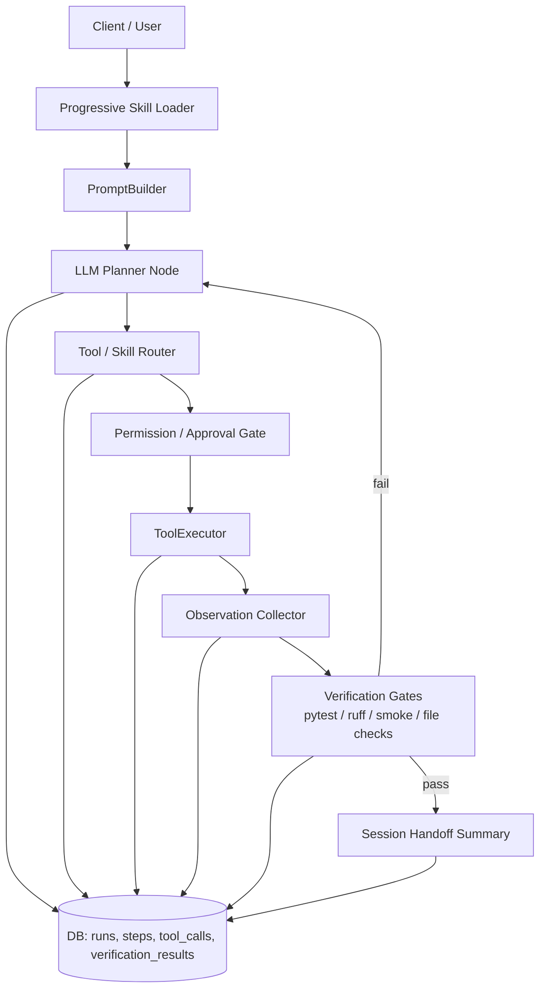

這會把目前三條分開的能力：

```text
/agent
/tools/{tool_name}/run
LangGraph skill runner
```

整合成一條更完整的 agent harness loop。

---

## 10. 建議實作順序

### Phase 3-1：把 Skill Runner 接成 API

新增：

```text
POST /skills/run
GET /skills
```

讓目前 CLI runner 可以透過 HTTP 測試。

### Phase 3-2：加入 run steps persistence

新增：

```text
agent_steps 或 run_steps
```

每個 LangGraph node 都寫入：

```text
run_id
step_name
status
input_json
output_json
error_message
created_at
```

### Phase 3-3：讓 tool_calls 關聯 run

讓 `tool_calls` 可追到哪一次 agent run / skill run 呼叫了它。

### Phase 3-4：Verification Gates

把目前 CLI 的 `verify` 從「檢查檔案」擴充成：

```text
pytest
ruff
curl smoke test
file exists
content contains expected marker
```

### Phase 3-5：LLM Planner Node

讓 LLM 根據：

```text
user goal
selected skill summaries
tool metadata
done criteria
```

輸出下一步要呼叫哪個 tool。

---

## 11. 簡短總結

目前專案已經從單純 LLM API 變成一個初步 Agent Harness：

```text
FastAPI + LLM Provider + SQLite + Tool Registry + Tool Executor + LangGraph Skill Runner
```

目前最重要的邊界是：

- `/agent` 負責對話與 LLM provider，已持久化 session/message/run。
- `/tools` 負責受控 tool execution，已持久化 `tool_calls`。
- `examples/langgraph_skill_runner.py` 負責測試 `SKILL.md → tool` 的 harness flow，目前是 CLI，不是 API。
- `SKILL.md` 是 declarative knowledge / routing hint；真正可執行工具仍由 `ToolRegistry` 管理。
- 漸進式分層架構應維持「repo docs → service foundation → tool foundation → skills → harness graph → LLM planner」的順序，不要跳過驗證直接做 autonomous agent。
